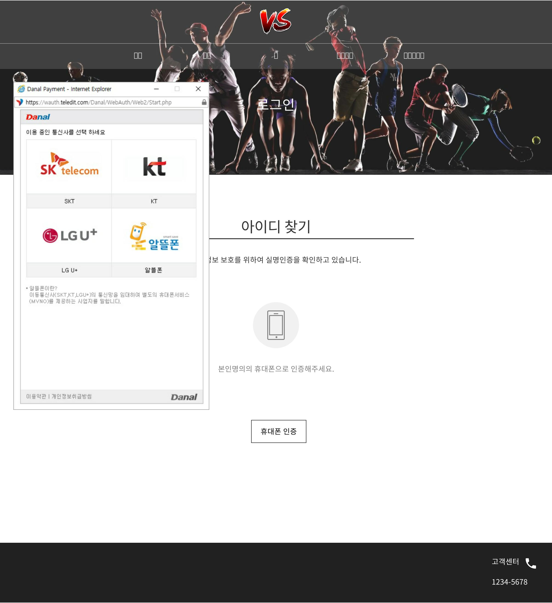

# uc005 - 아이디찾기_본인인증(FindId)
- 회원이 로그인을 하기위해 아이디를 찾는 것.

## 주 액터(Primary Actor)
회원

## 보조 액터(Secondary Actor)
본인인증시스템

## 사전 조건(Preconditions)
- 회원으로 로그인 되지 않은 상태이다.
- 액터가 로그인 유스케이스에서 로그인 할 ID를 잃어버렸다.

## 종료 조건(Postconditions)
- 액터가 아이디를 찾았다.

## 시나리오(Flow of Events)

### 기본 흐름(Basic Flows)

- 1. 액터가 '로그인 하기' 유스케이스에서 아이디찾기 버튼을 클릭할 때 이 유스케이스를 시작한다.
- 2. 시스템은 아이디찾기 폼을 출력한다.
- 3. 액터가 휴대폰 인증 버튼을 클릭한다.
- 4. 시스템은 '휴대폰 인증' 창을 출력한다.
- 5. 액터가 휴대폰 인증에 성공할 시, 시스템은 인증된 휴대폰번호와 일치하는 회원정보를 찾아서 아이디찾기_본인인증성공 폼을 출력한다.
- 6. 액터가 로그인 버튼을 클릭한다.
- 7. 시스템은 '로그인 하기' 유스케이스로 간다.

### 대안 흐름(Alternative Flows)

### 예외 흐름(Exception Flows)

- 5.1 휴대폰 인증에 실패할 시, 인증에 실패했음을 알리는 경고창을 출력하고 아이디찾기 폼으로 돌아간다.

## UI 프로토타입

### 아이디찾기

### 아이디찾기_본인인증창

### 아이디찾기_본인인증실패

### 아이디찾기_본인인증성공

