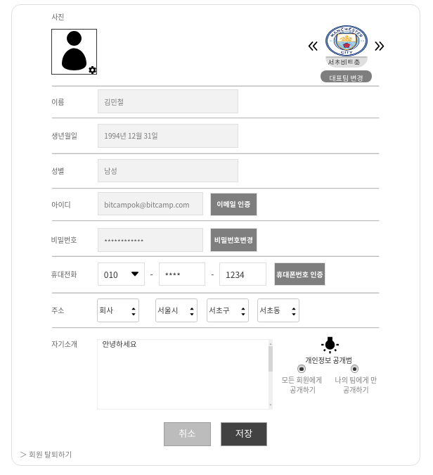

# UC0001 - 개인정보(My Profile)
 - 개인정보를 조회, 변경, 삭제 하는 유스케이스이다.
 
## 주 액터(Primary Actor)
 - 회원
 
## 보조 액터(Secondary Actor)
 

## 사전 조건(Preconditions)
 - 회원으로 로그인 되어 있다.

## 종료 조건(Postconditions)
 - 상단 다른 메뉴 버튼을 클릭한다.
 - 취소 버튼을 클릭한다.
 - 저장 버튼을 클릭한다.
 - 회원탈퇴 버튼을 클릭한다. 

## 시나리오(Flows of Events)

### 기본 흐름(Basic Flows of Events)

### 개인정보 수정하기
 1. 액터는 마이페이지 메뉴의 개인정보를 클릭한다.
 
 2. 시스템은 해당 회원의 정보(사진, 대표팀, 이름, 생년월일, 성별, 아이디, 비밀번호, 휴대전화, 주소, 자기소개, 개인정보공개범위)를 출력한다.

 3. 액터는 개인 신상 정보(사진, 대표팀, 이름, 생년월일, 성별, 비밀번호, \
      휴대전화, 주소, 자기소개, 개인정보공개범위)를 수정 후 저장 버튼을 클릭한다. \
   -액터가 소속된 팀이 없다면 시스템은 대표팀 정보를 출력하지 않는다. \
   -이름 입력란에 비속어가 포함되면 시스템은 알림메세지를 출력한다. \
   -액터가 비밀번호 변경시 '비밀번호 변경하기' 유스케이스로 간다. \
   -액터가 휴대전화 변경시 '휴대전화 변경하기' 유스케이스로 간다. 

 4. 액터는 정보를 변경 후 저장버튼을 클릭한다. \
   -필수 입력 항목(이름, 생년월일, 성별, 아이디, 비밀번호, 휴대전화, 주소)이 비어 있다면, \
   -시스템은 필수 입력 항목이 비어 있음을 알린다. \
   -시스템은 각 항목에서 인증을 받지 않은 항목이 있다면 알림메세지를 출력한다.

 5. 시스템이 바뀐 정보로 개인정보를 저장한다.

### 회원 탈퇴하기
 1. 액터는 '개인정보' 유스케이스에서 회원탈퇴하기를 클릭한다.

 2. 시스템은 알림메세지와 취소버튼, 확인버튼을 출력한다.

 3. 액터는 확인 버튼을 클릭한다. \
    -취소 버튼을 누르면 '개인정보' 유스케이스로 이동한다.
 
 4. 시스템은 알림메세지를 출력한다.

 5. 시스템은 해당 회원을 로그아웃 시킨다.

 6. 시스템은 해당 회원의 정보를 삭제한다.

 

### 비밀번호 변경하기

 1. 액터가 비밀번호변경 버튼을 클릭한다. 
 2. 시스템은 기존 비밀번호 입력란, 신규 비밀번호 입력란, 신규 비밀번호 확인 입력란이 있는 창을 출력한다.
 3. 액터가 기존 비밀번호 입력란, 신규 비밀번호 입력란, 신규 비밀번호 확인 입력란을 입력한다. 
 4. 액터가 기존 비밀번호 입력란, 신규 비밀번호 입력란, 확인 입력란에 비밀번호를 입력한 뒤 확인 버튼을 클릭한다. \
    -취소 버튼을 클릭하면 창을 닫는다. \
    -액터의 기존비밀번호와 신규비밀번호가 같다면 알림메세지를 출력한다. \
    -신규 비밀번호가 기존 비밀번호의 조건과 다르다면 시스템은 알림메세지를 출력한다. \
    -입력란이 비어있다면 시스템은 알림메세지를 출력한다. \
    -입력란과 입력확인란이 다르다면 시스템은 알림메세지를 출력한다.

### 휴대전화 변경하기

 1. 액터가 휴대전화정보를 변경한 뒤 휴대폰번호인증 버튼을 클릭한다. \
    -액터가 새로 입력한 휴대번호가 아니라면 시스템은 알림메세지를 출력한다. \
    -번호입력란이 한칸이라도 비어있다면 시스템은 알림메세지를 출력한다.
 2. 시스템은 인증번호 입력란을 출력한다.
 3. 시스템은 액터가 입력한 번호로 인증번호 문자를 보낸다.
 4. 액터가 인증번호를 입력란에 입력 후 확인버튼을 클릭한다. \
    -입력란이 비어있다면 시스템은 알림메세지를 출력한다. \
    -시스템이 보낸 문자의 인증번호와 다르다면 알림메세지를 출력한다. 
 5. 시스템은 새로운 휴대전화정보로 휴대전화정보를 변경한다.

## UI 프로토타입

