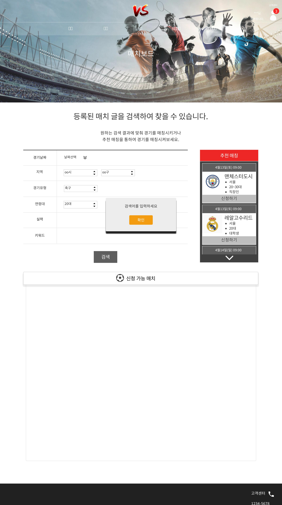

# UC002 - 매치보드 (MatchBoard)

매치 정보(추천 매치 포함)를 조회, 검색, 신청, 팀정보조회 하는 유스케이스이다.

## 주 액터(Primary Actor)

팀장, 팀원

## 보조 액터(Secondary Actor)

## 사전 조건(Preconditions)

- 팀장으로 로그인 되어 있다.
- 팀원으로 로그인 되어 있다.

## 종료 조건(Postconditions)

- 매치정보를 조회하였다.
- 키워드 검색하였다.
- 매치를 신청하였다.
- 매치 등록한 팀의 정보를 조회하였다.

## 시나리오(Flow of Evnets)

### 매치보드 조회하기

1. 엑터는 매치보드 메뉴를 클릭한다.
2. 시스템은 매치보드 폼을 출력한다.
3. 달력에 원하는 날짜를 클릭한다.
4. 시스템은 그 날짜에 해당되는 신청 가능 매치를 출력한다.

### 키워드 검색하기
1. 엑터는 키워드 검색 버튼을 클릭한다.
2. 시스템은 키워드 검색 폼을 출력한다.
3. 엑터는 검색란에 키워드를 입력한 후 검색 버튼을 클릭한다.
4. 시스템은 키워드에 맞는 검색 정보를 출력한다.
    - 검색란에 아무런 검색어를 넣지 않고 검색버튼을 클릭했을 시에
        - 시스템은 검색어를 입력하세요 메세지를 알린다.
    

### 매치 신청하기

1. 팀장은 등록된 매치 정보 밑에 신청하기 버튼을 클릭한다.
2. 시스템은 최종확인 알림을 출력한다.
3. 엑터는 확인 버튼을 누른다.
4. 시스템은 등록된 매치의 '팀 관리' 유스케이스에 신청 현황을 출력한 후 '매치보드 조회하기' 2번 유스케이스로 간다.

### 등록 매치 팀 정보 조회

1. 엑터는 등록된 매치 목록에 팀 앰블럼을 클릭한다.
2. 시스템은 등록된 매치의 팀 정보를 간략히 출력한다.

### 

## UI 프로토타입

![매치보드조회]
![매치보드신청]
![매치보드_팀정보]

