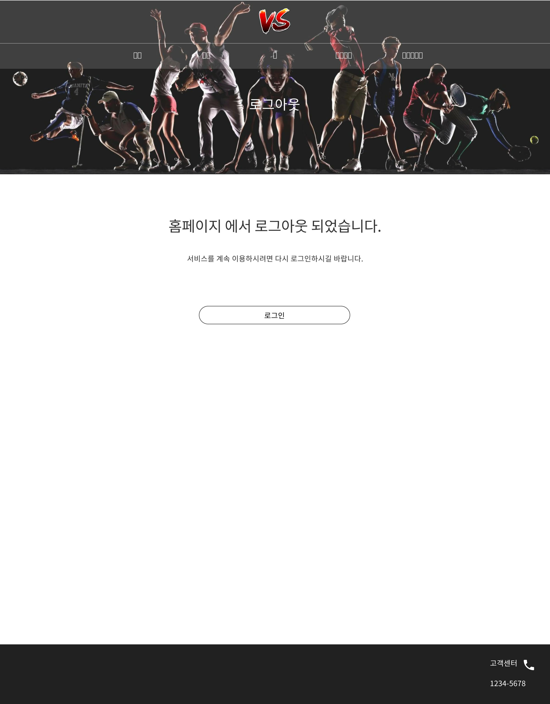

# uc004 - 로그인(Login)
- 회원이 로그아웃을 하는 것.

## 주 액터(Primary Actor)
회원

## 보조 액터(Secondary Actor)

## 사전 조건(Preconditions)
- 회원으로 로그인 된 상태이다.

## 종료 조건(Postconditions)
- 회원이 로그아웃 되었다.

## 시나리오(Flow of Events)

### 기본 흐름(Basic Flows)

- 1. 액터가 로그아웃 버튼을 클릭할 때 이 유스케이스를 시작한다.
- 2. 시스템은 로그아웃 폼을 출력한다.
- 3. 액터가 로그인 버튼을 클릭한다.
- 4. 시스템은 '로그인하기' 유스케이스로 간다.

### 대안 흐름(Alternative Flows)

### 예외 흐름(Exception Flows)

## UI 프로토타입

### 로그아웃

