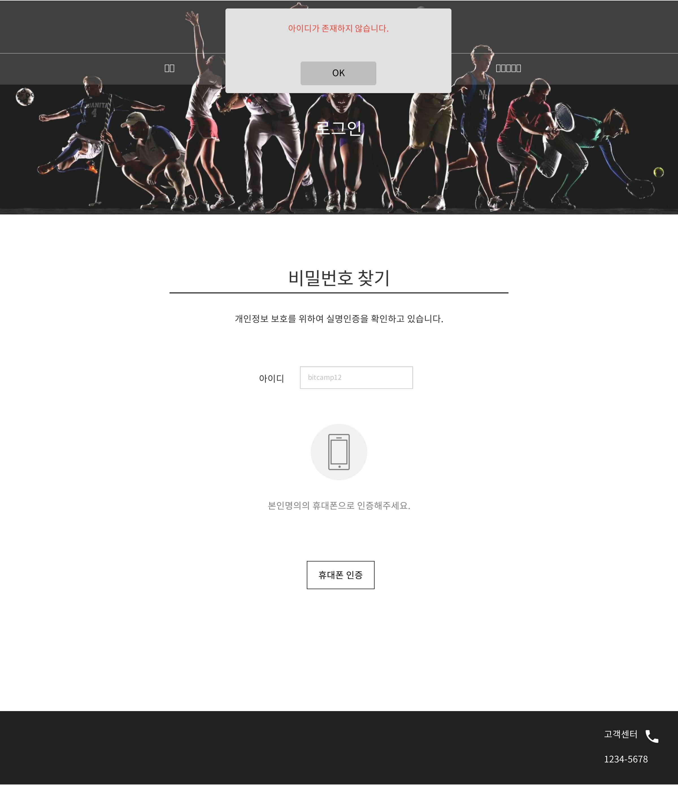
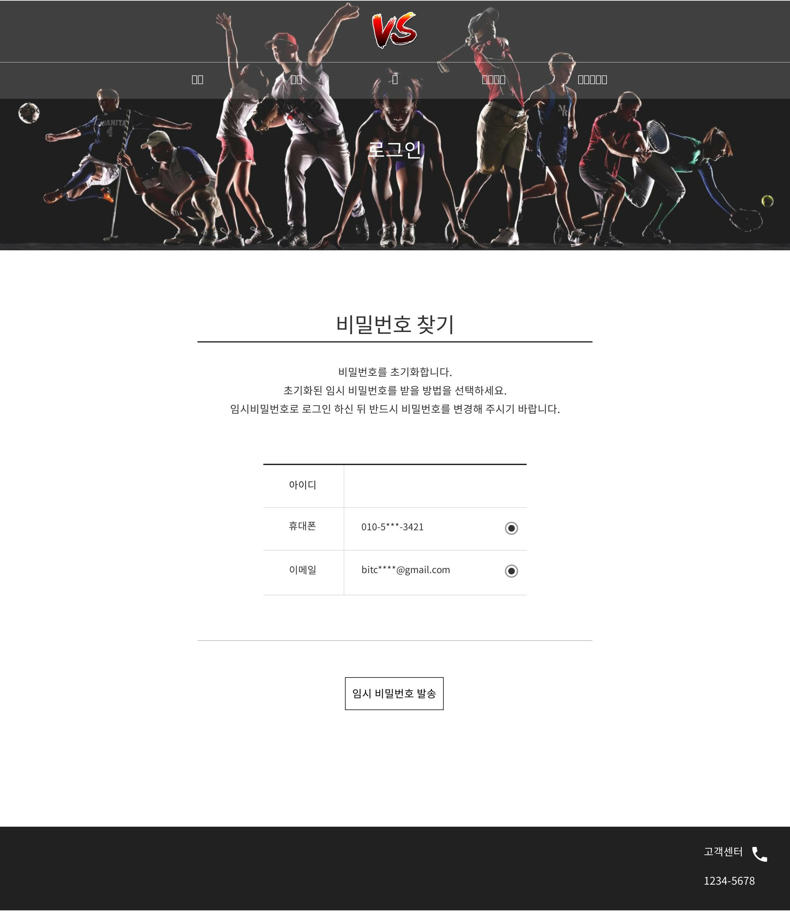

# uc006 - 비밀번호찾기_본인인증(FindPassword)
- 회원이 로그인을 하기위해 비밀번호를 찾는 것.

## 주 액터(Primary Actor)
회원

## 보조 액터(Secondary Actor)
본인인증시스템

## 사전 조건(Preconditions)
- 회원으로 로그인 되지 않은 상태이다.
- 액터가 로그인 유스케이스에서 로그인 할 비밀번호를 잃어버렸다.

## 종료 조건(Postconditions)
- 액터가 비밀번호를 찾았다.

## 시나리오(Flow of Events)

### 기본 흐름(Basic Flows)

- 1. 액터가 '로그인 하기' 유스케이스에서 비밀번호찾기 버튼을 클릭할 때 이 유스케이스를 시작한다.
- 2. 시스템은 비밀번호찾기 폼을 출력한다.
- 3. 액터가 아이디를 입력한다.
- 4. 액터가 휴대폰 인증 버튼을 클릭한다.
- 5. 시스템은 입력한 아이디가 시스템에 존재한다면
    - '휴대폰 인증' 창을 출력한다.
- 6. 액터는 휴대폰 인증을 한다.
- 7. 휴대폰 인증에 성공할 시,
    - 시스템은 인증된 휴대폰번호와 일치하는 회원정보를 찾고 해당 회원의 비밀번호를 초기화하고 임시비밀번호를 발급하고, 비밀번호찾기_본인인증성공 폼을 출력한다.
- 8. 액터가 임시비밀번호를 받을 방법을 선택하고 임시 비밀번호 발송 버튼을 누른다.
- 9. 임시비밀번호를 받을 방법이 이메일인 경우,
    - 시스템은 해당 회원의 이메일로 아이디와 임시비밀번호를 담은 메일을 전송한다.
- 10. 전송이 완료되면, 
    - 시스템은 전송이 완료되었음을 알리는 알림창을 출력한다.
- 11. 액터가 확인 버튼을 누르면, 시스템은 '로그인하기' 유스케이스로 간다.

### 대안 흐름(Alternative Flows)
- 9.1. 임시비밀번호를 받을 방법이 휴대폰인 경우,
    - 시스템은 해당 회원의 휴대폰으로 아이디와 임시비밀번호를 담은 문자메시지를 전송한다.

### 예외 흐름(Exception Flows)

- 5.1. 입력한 아이디가 시스템에 존재하지 않는다면,
    - 시스템은 입력한 아이디가 없음을 알리는 경고창을 출력한다.
- 7.1. 휴대폰 인증에 실패할 시, 
    - 시스템은 인증에 실패했음을 알리는 경고창을 출력하고 비밀번호찾기 폼으로 돌아 간다.
- 7.2. 휴대폰 인증에 성공했으나, 그 번호가 입력한 아이디에 인증된 휴대폰 번호와 일치하지 않는다면, 
    - 시스템은 인증된 휴대폰 번호와 회원정보가 일치하지 않는다는 경고창을 출력하고 비밀번호찾기 폼으로 돌아 간다.

## UI 프로토타입

### 비밀번호찾기

### 비밀번호찾기_본인인증예시

### 비밀번호찾기_본인인증_아이디 없음

### 비밀번호찾기_본인인증_인증실패

### 비밀번호찾기_본인인증_정보불일치

### 비밀번호찾기_본인인증성공

### 비밀번호찾기_본인인증성공_전송완료

