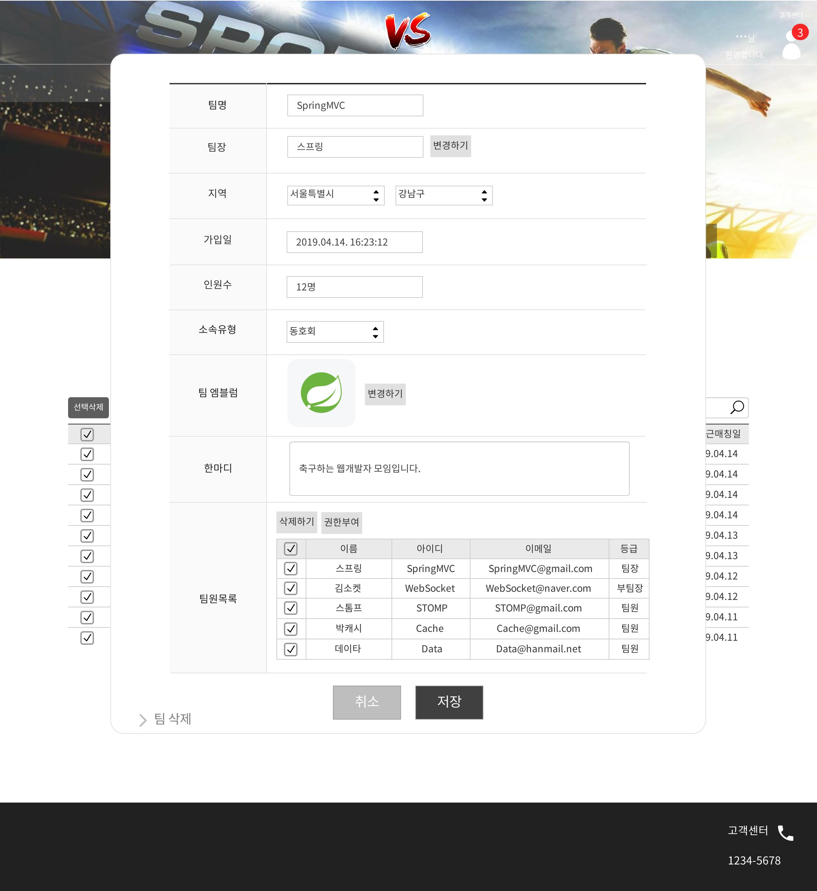
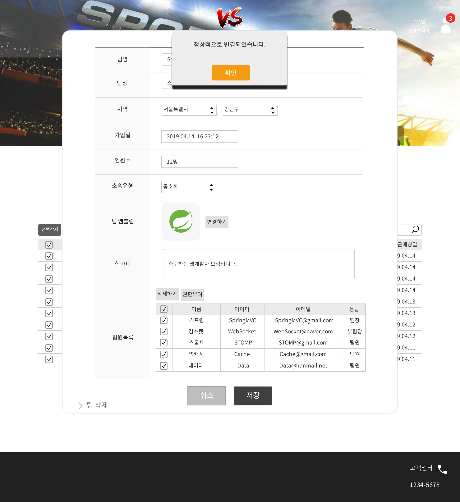

# uc042 - 팀관리(TeamManagement)
- 팀정보를 조회, 변경, 삭제하는 것.

## 주 액터(Primary Actor)
관리자

## 보조 액터(Secondary Actor)

## 사전 조건(Preconditions)
- 관리자로 로그인 되어 있다.

## 종료 조건(Postconditions)
- 팀정보를 조회하였다.
- 팀정보를 변경하였다.
- 팀정보를 삭제하였다.

## 시나리오(Flow of Events)

### 기본 흐름(Basic Flows)

- 1. 액터가 팀관리 버튼을 클릭할 때 이 유스케이스를 시작한다.
- 2. 시스템은 팀정보관리 폼을 출력한다.
- 3. 액터는 팀정보를 조회한다.
- 4. 액터가 분류를 선택하고 내용을 입력해서 검색한다면, 검색결과가 출력된다.

### 대안 흐름(Alternative Flows)

- 3.1 액터가 해당 팀의 튜플을 클릭하면 해당 팀의 상세정보가 담긴 상세정보 폼이 출력된다.
    - 상세정보 폼에서,
        - 취소버튼을 누르면 이전 화면으로 되돌아간다.
        - 팀정보를 변경하고 저장버튼을 누르면,
            - 정상적으로 저장될시 정상변경되었다는 메세지가 출력되고, 변경된 내용이 적용된 회원정보관리 폼으로 간다.
            - 정상적으로 저장에 실패할 시 저장을 실패했다는 메세지가 출력되고, 회원정보관리 폼으로 되돌아간다.
- 3.2 액터가 체크박스를 이용하여 체크하고, 선택삭제버튼을 누르면 선택한 팀정보를 삭제할 것이냐고 물어보는 알림창이 뜨고,
    - 확인을 누르면 팀정보가 삭제되고, 목록을 업데이트한다.
    - 취소를 누르면 원상태를 유지한다.

### 예외 흐름(Exception Flows)

## UI 프로토타입

### 팀관리_목록

### 팀관리_상세조회

### 팀관리_상세조회_변경확인

### 팀관리_상세조회_변경실패

### 팀관리_변경성공

### 팀관리_삭제확인

### 팀관리_삭제성공

