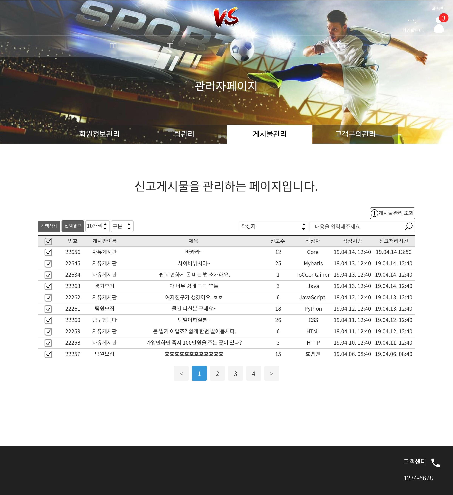

# uc044 - 신고게시판관리(ReportBoardManagement)
- 신고게시물을 조회, 삭제, 경고하는것.

## 주 액터(Primary Actor)
관리자

## 보조 액터(Secondary Actor)

## 사전 조건(Preconditions)
- 관리자로 로그인 되어 있다.

## 종료 조건(Postconditions)
- 신고게시물을 조회하였다.
- 신고게시물을 삭제하였다.
- 신고게시물을 작성한 회원에게 경고 메세지를 보냈다.

## 시나리오(Flow of Events)

### 기본 흐름(Basic Flows)

- 1. 액터가 '게시물관리' 유스케이스에서 신고게시판 조회 버튼을 클릭할 때 이 유스케이스를 시작한다.
- 2. 시스템은 신고게시판관리_목록 폼을 출력한다.
- 3. 액터는 신고게시물을 조회한다.
- 4. 액터가 분류를 선택하고 내용을 입력해서 검색한다면, 시스템은 검색결과를 출력한다.

### 대안 흐름(Alternative Flows)

- 3.1 액터가 해당 신고게시물이 있는 튜플을 클릭하면, 시스템은 해당 게시물의 상세정보가 담긴 상세조회 폼을 출력한다.
    - 상세정보 폼에서,
        - 액터가 취소버튼을 누르면 신고게시판관리_목록 폼으로 되돌아간다.
        - 액터가 삭제버튼을 누르면,
            - 시스템은 해당 게시물을 삭제할 것이냐고 물어보는 알림창을 출력하고, 액터는 알림창에서 게시물 작성자에게 보낼 내용을 드롭박스에서 선택하고,
                - 액터가 확인을 누르면, 시스템은 해당 회원에게 삭제 메세지를 전송하고, 게시물을 삭제하고, 신고게시판관리_목록 폼을 출력한다.
                - 액터가 취소를 누르면, 시스템은 상세정보 폼으로 되돌아간다.
- 3.2 액터가 체크박스를 눌러서 게시물을 선택하고 선택삭제버튼을 누르면, 시스템은 선택한 게시물을 삭제할 것이냐고 물어보는 알림창을 출력하고, 액터는 알림창에서 게시물 작성자에게 보낼 내용을 드롭박스에서 선택하고,
    - 액터가 확인을 누르면, 시스템은 회원정보를 삭제하고, 해당 게시물을 삭제한 신고게시판관리_목록 폼을 출력한다.
    - 액터가 취소를 누르면, 시스템은 신고게시판관리_목록 폼으로 되돌아간다.
- 3.3 액터가 체크박스를 눌러서 게시물을 선택하고 선택경고버튼을 누르면, 시스템은 선택한 게시물을 작성한 회원에게 경고를 할 것이냐고 물어보는 알림창을 출력하고,
    - 액터가 경고를 할 내용을 드롭박스에서 선택하고 확인을 누르면 시스템은 회원에게 경고메세지가 전송하고, 
        - 시스템은 선택한 회원들에게 경고 1회를 누적하고, 변경된 내용이 적용된 신고게시판관리_목록 폼을 출력한다.
    - 취소를 누르면 시스템은 신고게시판관리_목록 폼으로 되돌아간다.
        

### 예외 흐름(Exception Flows)

## UI 프로토타입

### 신고게시판관리_목록

### 신고게시판_상세조회

### 신고게시판_상세조회_삭제확인

### 신고게시판_상세조회_삭제성공

### 신고게시판_삭제확인

### 신고게시판_삭제성공

### 신고게시판_경고확인

### 신고게시판_경고성공
