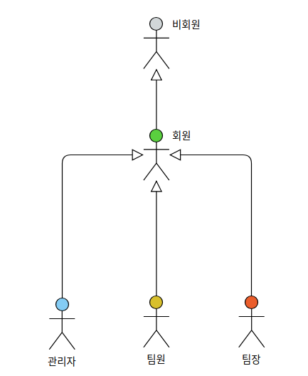
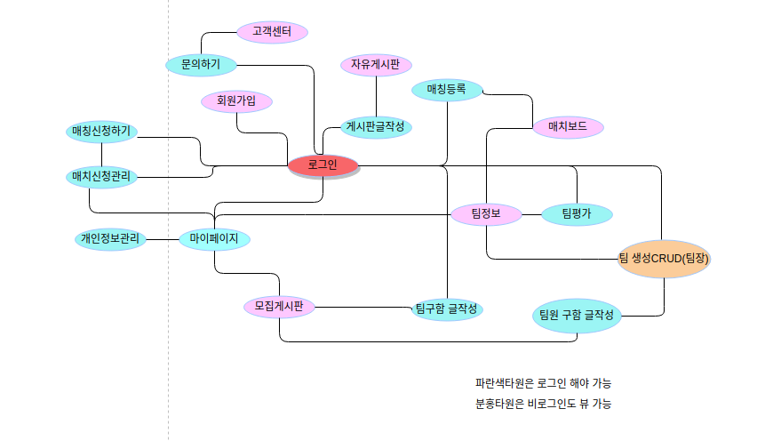

# Use-Case

## Actors

</img>

## UML
</img>

### 비회원
- 시스템에 로그인 하지 않은 사용자

### 회원
- 시스템에 로그인 한 사용자

### 관리자
- 관리자에 등록된 로그인 사용자

### 팀장
- 팀장에 등록된 로그인 사용자

### 팀원
- 팀원에 등록된 로그인 사용자

## Use-Cases

### [회원가입](uc001-SignUp.md)(비회원)
- 비회원이 로그인을 위해 회원에 가입하는 것.

### [회원탈퇴](uc002-SignOut.md)(회원)
- 회원이 서비스에서 탈퇴하는 것.

### [로그인 하기](uc003-Login.md)(회원)
- 회원이 로그인을 하는 것.

### 로그아웃하기(uc004-Logout.md)(회원)
- 회원이 로그아웃을 하는 것.

### [아이디찾기](uc005-FindId.md)(회원)
- 회원이 로그인을 하기위해 아이디를 찾는 것.

### [비밀번호찾기](uc006-FindPassword.md)(회원)
- 회원이 로그인을 하기위해 비밀번호를 찾는 것.

### [개인정보](uc011-MyProfile.md)(회원, 비회원)
 - 개인정보를 조회, 변경, 삭제 하는 유스케이스이다.

### [나의질문내역](uc012-MyQuestion.md)(회원)
 - 질문내역을 조회 하는 유스케이스이다.

### [팀 정보](uc021-TeamInfo.md)(팀장,팀원)
- 팀 정보를 조회 하고 팀 원을 수정하는 유스케이스이다.

### [팀 정보수정](uc022-TeamRevise.md)(팀장)
- 팀 정보를 수정하는 유스케이스이다.

### [보낸매치](uc023-SendMatch.md)(팀장,팀원)
- 보낸 매치를 관리하는 유스케이스이다.

### [받은매치](uc024-ReceiveMatch.md)(팀장,팀원)
- 받은 매치를 관리하는 유스케이스이다.

### [매치보드](uc031-MatchBoard.md)(팀장,팀원)
- 매치 정보(추천 매치 포함)를 조회, 검색, 신청, 팀정보조회 하는 유스케이스이다.

### [매치등록](uc032-CreateMatch.md)(팀장)
- 매치를 등록하는 유스케이스이다.

### [나의 매치 현황](uc033-MatchManagement.md)(팀장)
- 등록한 매치를 조회, 변경, 삭제 하는 유스케이스이다.

### [회원정보관리](uc041-MemberManagement.md)(관리자)
- 회원정보를 조회, 수정, 삭제, 경고하는 것.

### [팀관리](uc042-TeamManagement)(관리자)
- 팀정보를 조회, 수정, 삭제하는 것.

### [게시물관리](uc043-BoardManagemnet)(관리자)
- 게시물을 조회, 삭제하는 것.

### [신고게시판관리](uc044-ReportBoardManagement)(관리자)
- 신고게시물을 조회, 삭제, 경고하는것.

### [고객문의관리](uc045-CustomerEnquiryManagement)(관리자)
- 고객이 등록한 질문 및 개선사항을 조회, 답변, 삭제하는 것.

